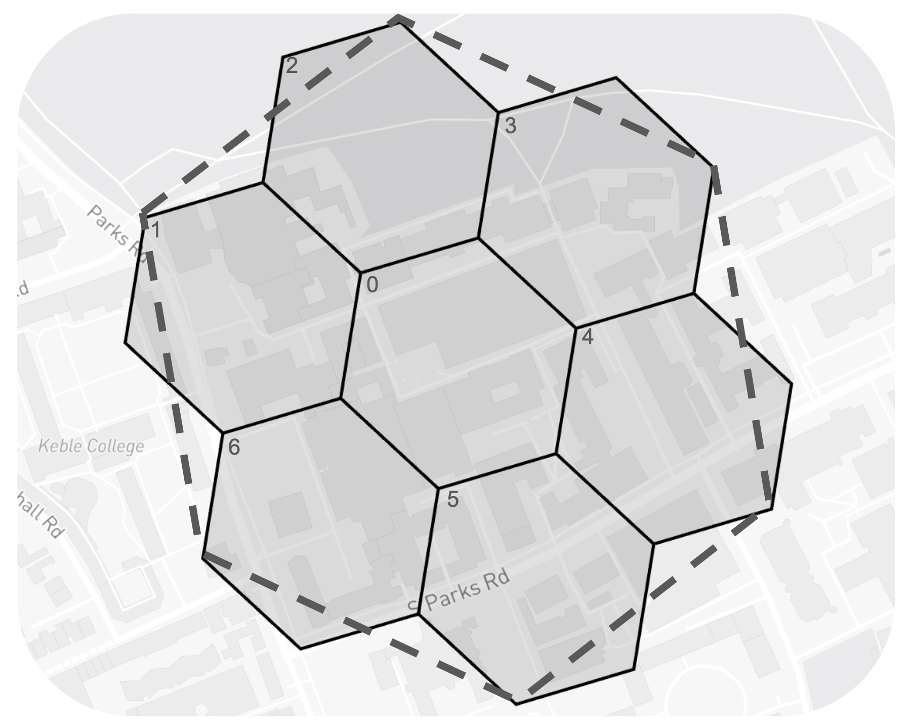
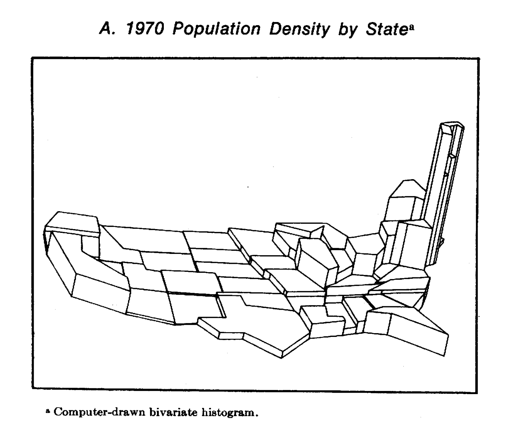
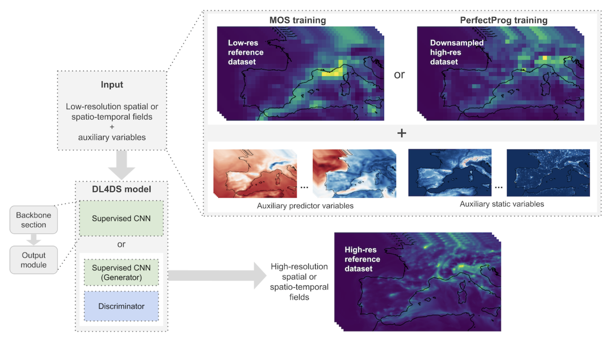

## Introduction

Down-scaling in order to increase the resolution of data on a grid/index/mesh. This usually comes at the cost of precision of the measure at the increased resolution, resulting from taking *averaged* values of the lower resolution that are given.

## Vocabulary note

**Resolution** - spatial precision of a value, can also be seen as an uncertainty, usually between 1 and some integer value (18 in the case of H3, 32 in the case of S2), a greater value corresponds to a finer resolution, in other words greater spatial precision, lower values are coarser resolution.

**Cell size** - the area of a grid cell, will usually depend on the resolution, a greater resolution means a smaller cell size, and inversely.

**Cell radius/diameter** - in the case of hexagonal cells, analogous to circle radius/diameter.

ex: H3 grid at resolution 10, the cell diameter is about 200 meter.

**Downscaling** - increasing the spatial resolution, reducing the size of cells we work with.

**Grid** - set of cells at a specific resolution

A value or distribution observed across an continuous area of interest can be projected onto a discrete grid, with a certain loss of information.

A grid represents a discrete representation of an area of interest, which is generally continuous, therefore having a greater resolution (smaller cell sizes) leads to more accurate values in a finite element approximation.

<!-- Interpolation as a way to fill in the gaps, in which we then downscale -->

## Example: Interpolation

<!-- Downscaling a **sinus** function. -->

```{r, fig.dpi=250, fig.width=6,fig.align = 'center'}
# layout-valign="bottom"

######

par(mfrow = c(2,2)
    ,yaxt = "n"
    ,mar = c(1,.5,1.5,.5)
    ,oma = c(1,1,1,1))
# params

step <- 20

x <- seq(-150, 150, by = 1) * pi / 100

noise <- rnorm(n=length(x),mean = 0,sd=.08)

sin_x <- sin(x) + noise

xlab <- "x"
ylab <- "y"
xlim <- c(-pi, pi)
ylim <- c(-1.1,1.1)
cex <- 0.5


x_step <- seq(-150, 150, by = step) * pi / 100

sin_x_step <- sin(x_step)

####

plot(x_step, sin_x_step,
  type = "p",
  ylab = ylab,
  xlab = xlab,
  col = "darkred",
  ,ylim=ylim
  ,xlim = xlim
  ,main = "Sample data"
  ,xaxt = "n"
)
# lines(x, sin_x, type = "l")

#####

plot(x_step - step * pi / 200, sin_x_step,
  type = "s",
  col = "darkred",
  xlab = xlab,
  ylab = ylab,
  xlim = xlim,
  ylim = ylim,
  main = "Step-wise interpolation"
  ,xaxt = "n"
  
)
points(x_step, sin_x_step, col = "darkred")
# lines(x, sin_x)

#####

plot(x_step, sin_x_step,
  type = "l",
  xlab = xlab,
  ylab = "",
  col = "darkred",
  ylim=ylim,
  xlim = xlim,
  main = "Linear interpolation"
)
# lines(x, sin_x)
points(x_step, sin_x_step, col = "darkred")

##### 

plot(x
     ,sin_x
     ,type = "l"
     ,ylab = ylab
     ,ylim = ylim
     ,xlim = xlim
     ,main = "Actual data"
     )

####

par(mfrow=c(1,1))

```

## Example : downscaling

```{r fig.dpi=250, fig.width=6,fig.align = 'center'}

par(mfrow = c(2,2)
    ,yaxt = "n"
    ,mar = c(1,.5,1.5,.5)
    ,oma = c(1,1,1,1))
# params
# 
# 
# # graphical  
# xlab <- "x"
# ylab <- "y"
# xlim <- c(-pi, pi)
# ylim <- c(-1,1)

# plotting variables 
# step <- 20
step_down <- 6

# x <- seq(-150, 150, by = 1) * pi / 100
# sin_x <- sin(x)

# x_step <- seq(-150, 150, by = step) * pi / 100

x_step_down <- seq(-150, 150, by = step_down) * pi / 100

sin_step_down <- c()
for (x_ in x_step_down) {
  sin_step_down <- append(sin_step_down,sin(x_step[which.min(abs(x_ - x_step))]))
}
sin_x_step <- sin(x_step)


sin_lin_down <- c()
for (x_ in x_step_down[-length(x_step_down)]) { 
  # x_ <- -2.2619467
  x_1 <- x_step[which(x_ >= x_step)[length(which(x_ >= x_step))]]
  x_2 <- x_step[which(x_ < x_step)[1]]
  sin_lin_down <- append(sin_lin_down, sin(x_1) + (x_ - x_1)*(sin(x_2) - sin(x_1))/(x_2 - x_1))
}
sin_lin_down <- append(sin_lin_down,sin(sin_lin_down[length(x_step_down)]))

####

plot(x_step, sin_x_step,
  type = "p",
  ylab = ylab,
  xlab = xlab,
  col = "darkred",
  ,ylim = ylim
  ,xlim = xlim
  ,main = "Sample data"
  ,xaxt = "n"
)

# lines(x, sin_x, type = "l")

#####

plot(x_step - step * pi / 200, sin_x_step,
  type = "s",
  # lty = 
  col = "darkred",
  xlab = xlab,
  ylab = ylab,
  xlim = xlim,
  ylim = ylim,
  main = "Step-wise interpolation"
  ,xaxt = "n"
)
points(x_step, sin_x_step, col = "darkred")
points(x_step_down,sin_step_down,col = "black",pch=19,cex=cex)
# lines(x, sin_x)

#####

plot(x_step, sin_x_step,
  type = "l",
  xlab = xlab,
  ylab = "",
  col = "darkred",
  ylim= ylim,
  xlim = xlim,
  main = "Linear interpolation"
)
# lines(x, sin_x)
points(x_step, sin_x_step, col = "darkred")
points(x_step_down,sin_lin_down,col="black",pch=19,cex=cex)

##### 

plot(x
     ,sin_x
     ,type = "l"
     ,ylab = ylab
     ,ylim = ylim
     ,xlim = xlim
     ,main = "Actual data"
     )

####

par(mfrow=c(1,1))

```

<!-- ## Resolution -->

<!-- ## lsdkfm -->

<!-- Interpolation is a method for infering values of a variable across a region from a limited set of measurements of that variable in the region. A number of assumptions are usually made in an interpolation process, most commonly the continuity of the modelled variable. -->

<!-- Downscaling and interpolation can be seen as joint techniques -->

<!-- TODO:  -->

<!-- Brief explanation of why both go hand in hand, examples of interpolation techniques . -->

<!-- How to apply them in downscaling -->

<!-- infering downscaled values from interpolated values. A way to do an 'educated' guess. -->

<!-- In our case, use most granular data avilable as one of the inputs and proxies for the donscaling of other values -->

## Binning and donwscaling

```{r fig.dpi=250, fig.width=6,fig.align = 'center'}

n <- 1500

x <- runif(n=n,min = -2,max = 2)
           # ,mean = 0,sd = .5)

x_norm <- rnorm(n = n,mean = 0,sd=1) + x 

step_ <- c(1,7,14)

par(mfrow=c(2,2)
    ,yaxt="n"
    ,mar = c(1,.5,1.5,.5)
    ,oma = c(1,1,1,1))

for (i in step_){
 hist(x_norm,breaks=i
      ,xlab = "x"
      ,ylab=""
      ,freq = FALSE
      ,main = paste0(i+1," bins counting")
      ,xlim = xlim
      ,xaxt = ifelse(i == step_[length(step_)],"s","n")
      )
}

density(x_norm) |> plot(xlab = "x"
                        ,ylab=""
                        ,xlim = xlim
                        ,main="continuous"
                        ,bty = "n")

par(mfrow=c(1,1))

```

## Data tranformation

### Renormalisation approach

Consists in updating the finer scale values from a known distribution at the given resolution. Using the average in the trivial case. This method ensures that the scale change is mass preserving (pycnophylactic).

::: columns
::: {.column width="50%"}
### Decreasing resolution
:::

::: {.column width="50%"}
### Increasing resolution
:::
:::

### Extensive case

::: columns
::: {.column width="50%"}
$$
W(H_i) = \sum_{j=0..6}w(h_{ij})
$$ It adds up.
:::

::: {.column width="50%"}
$$
w(h_{ij}) = g_W(h_{ij})W(H_i)
$$ such that $\sum_j g_W(h_{ij}) = 1$ is a density distribution associated to the variable $W$ inside location $H_i$ at higher resolution, that can be taken from external proxy data. In the trivial case, $g_W\equiv \frac{1}{N_c}$
:::
:::

### Intensive case

::: columns
::: {.column width="50%"}
$$
W(H_i)= \frac{\sum_jv_{ij}}{\sum_jq_{ij}}
$$

using the associated extensive variables $v,q$.

<!-- \sum_{j=0..6}g_w(h_{ij})w(h_{ij}) -->
:::

::: {.column width="50%"}
$$
w(h_{ij}) = W(H_i)
$$

in the trivial case. A more advanced approach would be to consider the associated extensive variables. If $W_{i}=\frac{V_{i}}{Q_{i}}$, then $w_{ij}=\frac{V_i g_{V}(h_{ij})}{Q_ig_Q(h_{ij})}$. Example: $GDP/cap$.
:::
:::

## In practice

::: columns
::: {.column width="50%"}
A parent cell $H_i^{(n)}$ with resolution $n$ contains a set of children $\{h^{(n+1)}_{ij}\}_{j=0...6}$ with resolution $n+1$. A value $W$ *measured* at $H_i^{(n)}$, $W(H)$ is downscaled into $w(h)$.

### Trivial rescaled case

For an extensive variable, if $W(H^n_i)=21$, we can downscale into 
$$w(h_{ij})=\frac{W(H^n_i)}{N_c}=\frac{21}{7}=3$$
for all j.

### General rescaled case

If, we have a known underlying distribution at a finer scale, say $g_W(h_{ij}) = 18/105$ for $j=\{0,1,4,5,6\}$, and $g_W(h_{i2})=1/21,g_W(h_{i3})=2/21$, we incorporate this data into the equation and get:

$$
w(h_{ij})=g_W(h_{ij})W(H_i) = 
\begin{cases}
    \frac{18}{105},& \text{for } j=0,1,4,5,6 \\
    \frac{5}{105},              & \text{for } j=2\\
    \frac{10}{105}, & \text{for } j=3\\
\end{cases}
$$
for each children cell.

:::

::: {.column width="50%"}
{fig-align="center"}
:::
:::

## Literature

@tobler1979

::: columns
::: {.column width="50%"}
> pycnophylactic : mass preserving
:::

::: {.column width="50%"}
{fig-align="center" width="100%"}
:::
:::

## Literature

@roudier2017

@bürger2012;

@giuliani2022;

@malone2012;

@vrac2007;

@schoof2013;

@frías2006;

@murakami2019;

@khan2006;

@ekström2015

## Literature

### Contemporary methods: DL

@gonzalez2022

python package: [dl4ds](https://carlos-gg.github.io/dl4ds/dl4ds.html)

{fig-align="center" width="60%"}

## Online material

### Packages

**R**

-   [`pyconphy`](https://rdrr.io/github/rspatial/predicts/man/pycnophy.html): pycnophylactic interpolation
-   [`dissever`](https://github.com/pierreroudier/dissever)
    -   [`caret`](https://topepo.github.io/caret/)
    -   [`gam`](https://m-clark.github.io/generalized-additive-models/application.html)
    -   [`randomForest`](https://www.r-bloggers.com/2021/04/random-forest-in-r/)
    -   [`Cubist`](https://topepo.github.io/Cubist/index.html)
    -   [`gstat`](https://r-spatial.github.io/gstat/)
-   [`ClimDown`](https://github.com/pacificclimate/ClimDown)
-   [LULCdown](https://github.com/ggiuliani/LULCdown?tab=readme-ov-file)
-   [downscaleR](https://github.com/SantanderMetGroup/downscaleR)
-   [CDT](https://iri.columbia.edu/~rijaf/CDTUserGuide/html/cdt_file_menu.html)

## References
