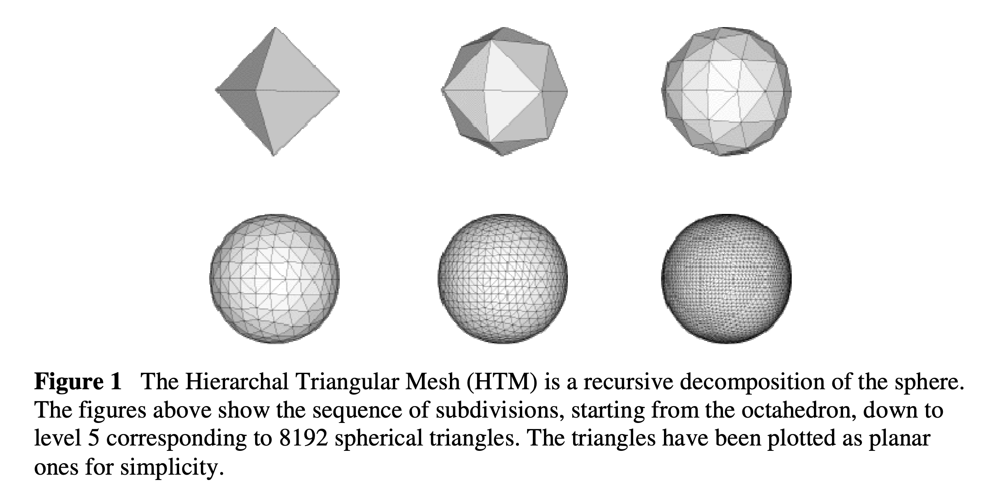
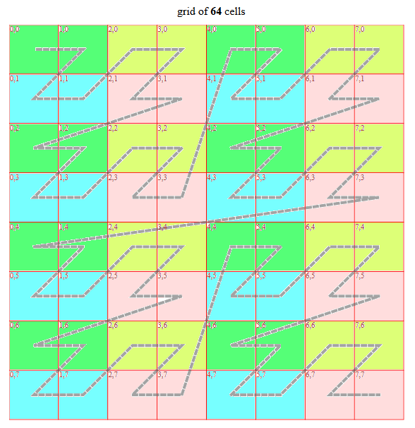
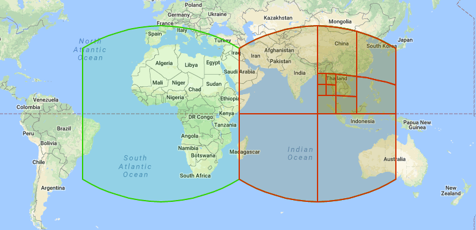
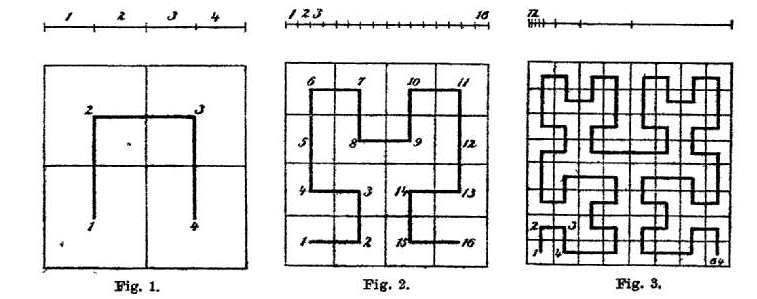
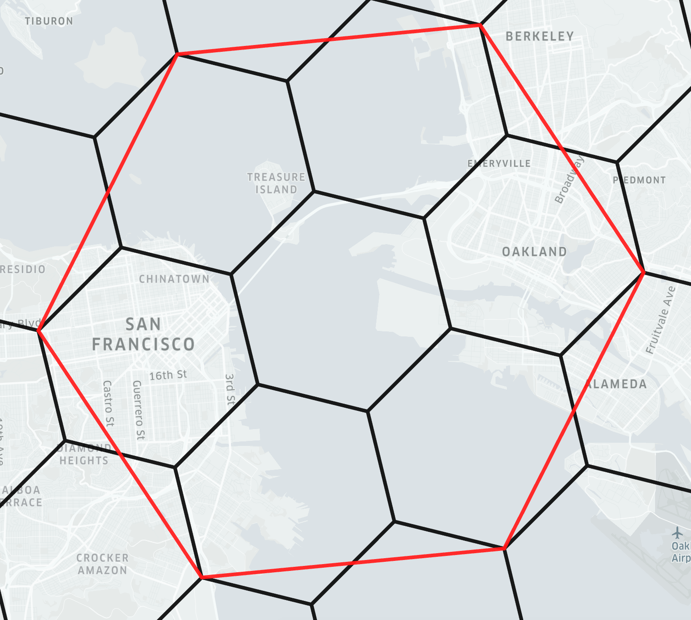

```{r echo=FALSE}

reticulate::use_python("/Users/cenv1069/micromamba/envs/overture-dl/bin/python")

# reticulate::use_condaenv(condaenv = "/Users/ivannschlosser/micromamba/envs/overture-dl")

# https://h3geo.org/docs/highlights/flowmodel
# 
# https://github.com/uber/h3-py-notebooks/tree/master 
# 
# https://pro.arcgis.com/en/pro-app/latest/help/data/geodatabases/overview/an-overview-of-spatial-indexes-in-the-geodatabase.htm 
# 
# https://www.crunchydata.com/blog/the-many-spatial-indexes-of-postgis
# 
# https://www.cockroachlabs.com/docs/stable/spatial-indexes 
# 
# https://gee-community-catalog.org/projects/cisi/
# 
# http://s2geometry.io
# 
# https://docs.placekey.io/documentation

```

## Intro slide

#### What are we talking about ?

> Geospatial indexes: discrete global grid systems consisting of a multi-precision tiling of the sphere (plane) with hierarchical indexes.

### Wide and evolving topic

This presentation will cover the main spatial indexes that are out there. Usage of one of them could potentially increase efficiency of workflows, especially when working with multiple layers of large (global) data sets from different sources and at various resolutions. Standardizing the data layers other a single index can have a positive impact when sharing data sets included in the various packages. Spatial data is a lot faster to query and analyse when properly indexed, potentially allowing for great performance gains on the server and client sides of APIs.

### Context

While data base systems rely usually on a set of slightly different indexing techniques that adapt to the data provided, such as [B-Trees](https://en.wikipedia.org/wiki/B%2B_tree), [R-Trees](https://en.wikipedia.org/wiki/R-tree) and their many derivatives, there has been a strong significant development of tools that are more adapted for a general purpose data science workflow, providing a predefined (in-memory) subdivision system that can serve as a basis from which any other spatial data set can be expressed. On top of allowing very efficient querying and analysis, it also constitutes a form of representation of the data. This document reviews some of the most famous and widely adopted ones.

## HTM

::: columns
::: {.column width="60%"}
> Formalised in @szalayIndexingSphereHierarchical2007
:::

::: {.column width="40%"}
{fig-align="center"}
:::
:::

::: aside
source: <https://arxiv.org/pdf/cs/0701164>
:::

## Geohash

::: columns
::: {.column width="60%"}
> Developed by [Gustavo Niemeyer](https://web.archive.org/web/20080305223755/http://blog.labix.org/#post-85), 2008

-   de facto standard on many systems (postGIS)

-   open-source

-   OpenStreetMap shortlink predecessor

-   space-filling Morton curve along which indexation happens
:::

::: {.column width="40%"}
{fig-align="center"}
:::
:::

## Geohash

### More material

-   [GeoHash](https://www.movable-type.co.uk/scripts/geohash.html)

### Similar systems

-   [QuadTiles](https://wiki.openstreetmap.org/wiki/QuadTiles)

-   [what3words](https://what3words.com/dance.cave.trend)

## S2

::: columns
::: {.column width="60%"}
> Developed by Google

-   original library in C++/Java

-   open source

-   bindings to many other languages/systems

-   each cell is a quadrilateral bounded by four geodesics, see @fig-grid

    -   in other words, a square on a sphere

-   levels from 0 to 30

    -   Every $cm^2$ on Earth can be represented using a 64-bit integer

-   cells are ordered sequentially along a space filling curve, see @fig-space_fillig
:::

::: {.column width="40%"}
[{#fig-grid fig-align="center" width="100%"}](http://s2geometry.io/devguide/s2cell_hierarchy)

{#fig-space_fillig fig-align="center"}
:::
:::

::: aside
source: <http://s2geometry.io/devguide/s2cell_hierarchy>
:::

## S2

### More material

-   [S2](http://s2geometry.io)

-   [S2 presentation](https://docs.google.com/presentation/d/1Hl4KapfAENAOf4gv-pSngKwvS_jwNVHRPZTTDzXXn6Q/edit#slide=id.i28)

## H3

::: columns
::: {.column width="60%"}
> Developped by Uber

-   original library in C
-   open-source
-   bindings to many other languages/systems
-   hexagonal shapes
-   hierarchical (see @fig-h3_hier)
-   Theory: [@sahrCentralPlaceIndexing2014]
:::

::: {.column width="40%"}
{#fig-h3_hier .lightbox fig-align="center" width="100%"}
:::
:::

::: aside
source: <https://h3geo.org/docs/highlights/indexing>
:::

## H3

-   edge indexation (useful to model flows for example), nearest neighbours

-   node indexation

-   the nature of the projection imposes that a constant number of 12 pentagons is present in the index at each level.

### More material

-   interactive [visualisation](https://observablehq.com/@nrabinowitz/h3-index-inspector?collection=@nrabinowitz/h3)

-   more online [materials](https://observablehq.com/collection/@nrabinowitz/h3-tutorial)

-   [H3](https://h3geo.org)

### Similar systems

-   [Placekey](https://www.placekey.io): built on top of H3 with additional information on the type of feature being encoded, relevant for infrastructure mapping for example.

## More online material

-   [Carto](https://docs.carto.com/data-and-analysis/analytics-toolbox-for-bigquery/key-concepts/spatial-indexes)
-   [Carto Academy](https://academy.carto.com/working-with-geospatial-data/introduction-to-spatial-indexes)
-   [Bing Maps Tile System](https://learn.microsoft.com/en-us/bingmaps/articles/bing-maps-tile-system)

### Others

Mainly legacy ones

-   [healpix](http://healpix.jpl.nasa.gov)

-   [COBE](http://lambda.gsfc.nasa.gov/product/cobe/skymap_info_new.cfm)

# Application

## Example H3

> Find all the locations of amenities along roads in a part of Tanzania.

We pick a convenient grid resolution, for example level `py h3_level=8`.

To get the data, follow the process explained in [this doc](https://ischlo.github.io/presentations/overture_roads/#/title-slide), for example.

```{python}
#| echo: true
import duckdb as db
import geopandas as gpd
import h3

# pois
pois = gpd.read_parquet("tanzania_pois.geoparquet")

# roads
roads = gpd.read_parquet("tanzania_roads.geoparquet")
```

#### Pick a resolution

```{python}
#| echo: true
# h3 resolution
res=8

```

## Projecting on the H3 grid

```{python}
# extracting the main class as a column
pois["mclass"]=pois["categories"].apply(lambda x: x.get("main") if x else None)

# getting the bbox of each geometry for faster queries. this is a dict variable of the parquet file.

roads["xmin"]=roads.bbox.apply(lambda x: x["xmin"])
roads["xmax"]=roads.bbox.apply(lambda x: x["xmax"])
roads["ymin"]=roads.bbox.apply(lambda x: x["ymin"])
roads["ymax"]=roads.bbox.apply(lambda x: x["ymax"])

# roads[["xmin","ymin","xmax","ymax"]].head()

# bboxes of choice
# xmin,ymin,xmax,ymax
bbox = [37.996,-7.303,39.628,-5.676]
bbox_songea = [34.827,-11.346,36.458,-9.720]

# functino for quick filtering of roads
def filter_roads(roads,bbox):
    # roads
    return roads.query(f"xmin>{bbox[0]} and xmax<{bbox[2]} and ymin>{bbox[1]} and ymax<{bbox[3]}")

# filtering roads 
roads_bb = filter_roads(roads=roads
                        ,bbox=bbox_songea)

print(roads_bb.shape)
```

- The idea is to map things to the H3 grid, to then express them as sets of h3 cells.
- The nature of the index should significantly speed up computations when doing all sorts of geometric operations

Getting the h3 index of all the road nodes:

```{python}
#| echo: true
coords = roads_bb.get_coordinates()

coords_h3 = coords.apply(lambda row: h3.latlng_to_cell(row[1],row[0],res), axis=1)

```

### Filling the gaps

```{python}
def flatten(xss):
    return [x for xs in xss for x in xs if len(xs)>=2]

```

Computing cells along shortest paths between nodes (approximating all the edges)

```{python}
#| echo: true

# get the list of h3 indexes for a linestring and return the full set of hex codes it touches
def path_from_h3(h3_list):
    return flatten(map(h3.grid_path_cells,h3_list[:-1],h3_list[1:]))

h3_paths = coords_h3.groupby(level=0).apply(lambda x: path_from_h3(x))

```

```{python}
h3_road = pd.Series(flatten(h3_paths)).unique()
h3_road

# %%
roads_cells = pd.Series(h3_road,name="hex").reset_index()
roads_cells

# %%
radius = math.sqrt(h3.cell_area(roads_cells["hex"][0],unit="m^2"))
print(f"Typical ditance in cell: {radius:.0f} meters")

# %%
# Preparing the data before plotting
bounds = pois.geometry.total_bounds
##
lon_center = float((bounds[0]+bounds[2])/2)
lat_center = float((bounds[1]+bounds[3])/2)

# %%
roads_cells[["hex","index"]].head(3)

```

We can now pass this to a *deck.gl* map with the `pydeck` package.

```{python}

import pydeck as pdk

```

## Mapping

```{r eval=TRUE,include=TRUE}

htmltools::includeHTML("support/h3_pois_roads_layer.html")

```

## References
